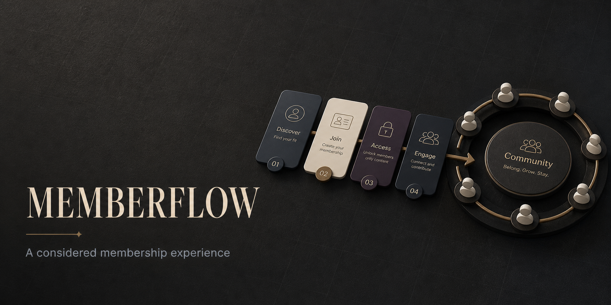
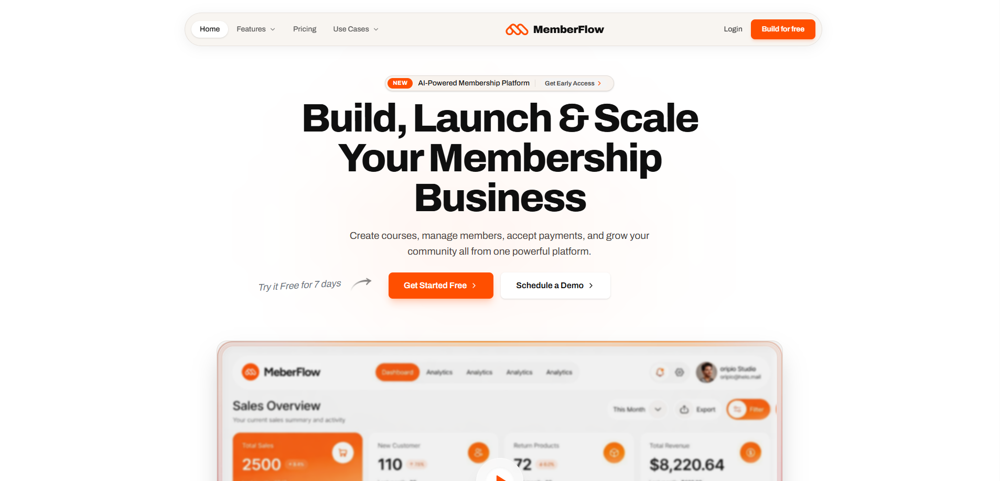

<div align="center">



# MemberFlow Landing Page

**High-converting, editorial SaaS marketing landing page concept with fluid motion.**

[**View Live Demo: saas-landingpage-amandeavor.netlify.app →**](https://saas-landingpage-amandeavor.netlify.app)

[](https://saas-landingpage-amandeavor.netlify.app)
[](https://react.dev/)
[](https://www.typescriptlang.org/)
[](https://vitejs.dev/)
[](https://tailwindcss.com/)
[](https://www.framer.com/motion/)
[](https://github.com/amandeavor/SaaS-Landing-Page/actions/workflows/ci.yml)

<p align="center">
  <a href="#overview">Overview</a> •
  <a href="#visual-preview">Preview</a> •
  <a href="#key-capabilities">Capabilities</a> •
  <a href="#quickstart">Quickstart</a> •
  <a href="#guidelines">Guidelines</a>
</p>

</div>

---

## Overview

`MemberFlow` is an editorial, modern SaaS marketing site designed for recurring membership and subscription platforms. It emphasizes conversion-focused information architecture, responsive asymmetric bento layouts, high-contrast typography, and fluid micro-interactions.

---

## Visual Preview

<div align="center">
  
</div>

---

## Key Capabilities

| Component | Architecture & Design Highlights |
| :--- | :--- |
| **Hero Conversion Section** | Compelling value proposition with tight tracking typography and social proof validation badges. |
| **Feature Bento Grid** | Responsive asymmetric grid showcasing product capabilities with subtle hover states. |
| **Dynamic Pricing Switcher** | Interactive Monthly vs. Annual billing toggle with real-time discount calculations. |
| **Interactive Testimonials** | Smooth customer review carousel highlighting key customer metrics. |
| **Call-to-Action Finale** | High-contrast registration funnel with conversion-optimized action buttons. |

---

## Quickstart

### Prerequisites
- Node.js `18+` LTS
- npm `9+`

### Setup

```bash
# 1. Clone repository
git clone https://github.com/amandeavor/SaaS-Landing-Page.git
cd SaaS-Landing-Page

# 2. Install dependencies
npm install

# 3. Launch local dev server
npm run dev
```

---

## Available Commands

```bash
# Production Vite build
npm run build

# Preview production build locally
npm run preview
```

---

## Community & Guidelines

- [Contributing Guide](CONTRIBUTING.md)
- [Security Policy](SECURITY.md)
- [Code of Conduct](CODE_OF_CONDUCT.md)

---

## Notes & License

This repository is a frontend engineering and design demonstration. It does not include backend auth, real billing APIs, or customer databases. All rights reserved.
